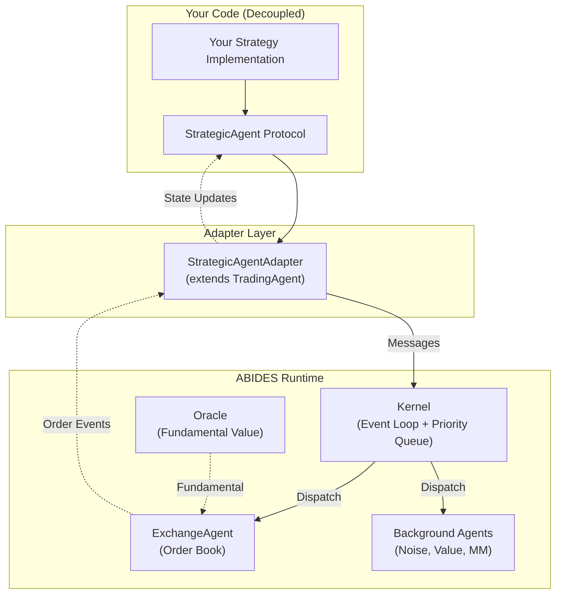
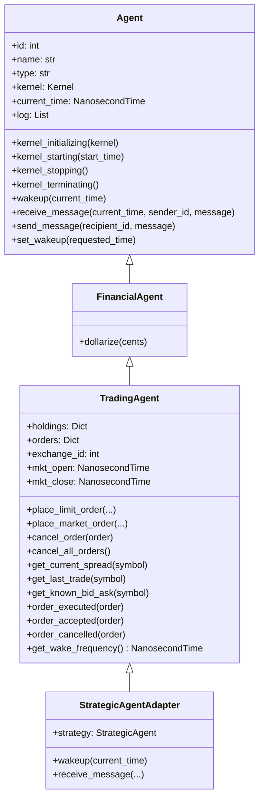
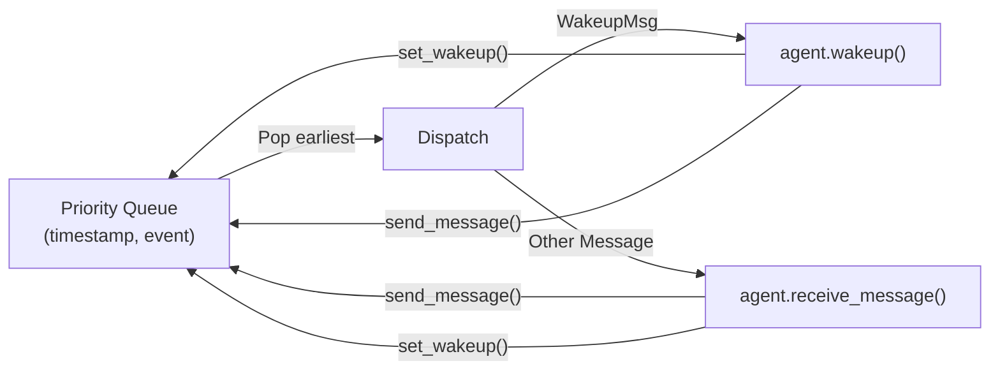

# ABIDES Custom Agent Implementation Guide

## Decoupling Interface & Adapter Pattern for Custom Trading Strategies

---

## Table of Contents

1. [Architecture Overview](#1-architecture-overview)
2. [ABIDES Internals — What You Need to Know](#2-abides-internals--what-you-need-to-know)
3. [Class Hierarchy & Inheritance Map](#3-class-hierarchy--inheritance-map)
4. [Agent Lifecycle — The 6 Phases](#4-agent-lifecycle--the-6-phases)
5. [The Kernel Event Loop — How Time Works](#5-the-kernel-event-loop--how-time-works)
6. [Message Protocol & Order Flow](#6-message-protocol--order-flow)
7. [State Inference — The Logging Trap](#7-state-inference--the-logging-trap)
8. [Decoupling Interface Design](#8-decoupling-interface-design)
9. [Adapter Class — Bridging Into ABIDES](#9-adapter-class--bridging-into-abides)
10. [Config Integration — Injecting Your Agent](#10-config-integration--injecting-your-agent)
11. [Extracting Results After Simulation](#11-extracting-results-after-simulation)
12. [Gotchas & Pitfalls](#12-gotchas--pitfalls)
13. [Quick-Start Recipes](#13-quick-start-recipes)

---

## 1. Architecture Overview

ABIDES is a **discrete-event, message-passing simulation** framework. It is *not* a traditional loop-based simulator — time advances by jumping to the next event in a priority queue. This has profound implications for how you design agents.



**Key principle**: Your strategy code should know *nothing* about ABIDES internals. The adapter translates between your clean API and ABIDES's message-based event system.

---

## 2. ABIDES Internals — What You Need to Know

### 2.1 Time Representation

All time in ABIDES is in **nanoseconds** (`NanosecondTime = int`). There are no `datetime` objects inside the simulation — only `int` values representing nanoseconds since epoch.

```python
# Converting human-readable to nanoseconds
from abides_core.utils import str_to_ns
one_second = str_to_ns("1s")      # 1_000_000_000
market_open = str_to_ns("09:30:00")  # nanoseconds from midnight
```

### 2.2 Prices

All prices are in **integer cents** (1 dollar = 100). A stock at $1,000.00 has `price = 100_000`. This avoids floating-point issues in financial calculations.

### 2.3 Cash & Holdings

Cash is tracked as integer cents in `self.holdings["CASH"]`. Share positions are tracked as integers in `self.holdings["SYMBOL"]`.

### 2.4 The Oracle

The oracle provides the "true" fundamental value of assets. Background agents use it to inform their beliefs. Your custom agent may or may not use it — accessing it via `self.kernel.oracle` is available but optional.

---

## 3. Class Hierarchy & Inheritance Map



> [!IMPORTANT]
> **Always extend `TradingAgent`**, not `Agent` or `FinancialAgent`. `TradingAgent` handles exchange discovery, market hours, order lifecycle, portfolio tracking, and bid/ask caching. If you skip it, you must reimplement ~1,200 lines of plumbing.

---

## 4. Agent Lifecycle — The 6 Phases

Every agent in ABIDES goes through a strict lifecycle managed by the Kernel:

```
┌─────────────────────────────────────────────────────────────────┐
│ Phase 1: kernel_initializing(kernel)                            │
│   • Kernel reference stored (self.kernel = kernel)              │
│   • No other agents guaranteed to exist yet                     │
│   • DO NOT send messages here                                   │
├─────────────────────────────────────────────────────────────────┤
│ Phase 2: kernel_starting(start_time)                            │
│   • All agents exist now                                        │
│   • TradingAgent discovers ExchangeAgent via                    │
│     kernel.find_agents_by_type(ExchangeAgent)                   │
│   • First wakeup scheduled via set_wakeup(start_time)           │
│   • Override get_wake_frequency() to control first-wake delay   │
├─────────────────────────────────────────────────────────────────┤
│ Phase 3: wakeup(current_time) — MAIN STRATEGY ENTRY POINT      │
│   • Called when your scheduled alarm fires                      │
│   • First wakeup: TradingAgent requests market hours            │
│   • Subsequent wakeups: your strategy logic runs here           │
│   • MUST call super().wakeup(current_time) first                │
│   • Schedule next wakeup with self.set_wakeup(next_time)        │
├─────────────────────────────────────────────────────────────────┤
│ Phase 4: receive_message(current_time, sender_id, message)      │
│   • Called when incoming messages arrive (order fills, data, ..) │
│   • TradingAgent routes messages to typed handlers              │
│   • Override order_executed(), query_spread(), etc.              │
│   • MUST call super().receive_message(...) first                 │
├─────────────────────────────────────────────────────────────────┤
│ Phase 5: kernel_stopping()                                      │
│   • All agents still exist                                      │
│   • TradingAgent logs final holdings, marks to market            │
│   • Good place to compute your strategy metrics                 │
├─────────────────────────────────────────────────────────────────┤
│ Phase 6: kernel_terminating()                                   │
│   • Agent logs written to disk                                  │
│   • No other agents guaranteed to exist                         │
│   • DO NOT send messages here                                   │
└─────────────────────────────────────────────────────────────────┘
```

> [!CAUTION]
> The very first `wakeup()` call does **not** mean the market is open. `TradingAgent.wakeup()` returns a boolean indicating trade-readiness. You must check `self.mkt_open` and `self.mkt_close` are set before trading. Market hours are received asynchronously via a message exchange in `receive_message`.

---

## 5. The Kernel Event Loop — How Time Works



**Critical details**:

1. **Time only advances** when the Kernel pops the next event. There is no "tick" — no `on_bar()` callback. You decide your own schedule via `set_wakeup()`.

2. **Computation delay**: After each wakeup/message, the agent's "local clock" advances by `computation_delay` nanoseconds. The agent **cannot act again** until the global clock catches up. This prevents infinite loops of simultaneous events.

3. **Latency**: Messages between agents are delayed by a latency model. Your order doesn't reach the Exchange instantly — it arrives after `latency + computation_delay` nanoseconds.

4. **No synchronous responses**: When you call `get_current_spread(symbol)`, a *request message* is sent to the Exchange. The response arrives asynchronously later as a `QuerySpreadResponseMsg` inside `receive_message()`. This is a fundamental architectural constraint.

---

## 6. Message Protocol & Order Flow

### 6.1 Placing an Order

```
Your Agent                    Kernel                     Exchange
    │                           │                           │
    ├── place_limit_order() ──► │                           │
    │   (creates LimitOrderMsg) │                           │
    │                           ├── deliver after latency ─►│
    │                           │                           ├── OrderAcceptedMsg
    │                           │◄──────────────────────────┤
    │◄── receive_message() ─────┤                           │
    │    (order_accepted)       │                           │
    │                           │                           │
    │                           │  ... time passes ...      │
    │                           │                           │
    │                           │                           ├── OrderExecutedMsg
    │                           │◄──────────────────────────┤  (partial or full fill)
    │◄── receive_message() ─────┤                           │
    │    (order_executed)       │                           │
```

### 6.2 Key Message Types

| Direction | Message | Purpose |
|-----------|---------|---------|
| Agent → Exchange | `LimitOrderMsg`, `MarketOrderMsg` | Place orders |
| Agent → Exchange | `CancelOrderMsg` | Cancel an open order |
| Agent → Exchange | `QuerySpreadMsg` | Request current bid/ask |
| Agent → Exchange | `QueryLastTradeMsg` | Request last trade price |
| Agent → Exchange | `MarketHoursRequestMsg` | Ask for open/close times |
| Agent → Exchange | `L2SubReqMsg` | Subscribe to L2 data feed |
| Exchange → Agent | `OrderAcceptedMsg` | Order entered the book |
| Exchange → Agent | `OrderExecutedMsg` | Order (partially) filled |
| Exchange → Agent | `OrderCancelledMsg` | Order cancelled |
| Exchange → Agent | `QuerySpreadResponseMsg` | Bid/ask response |
| Exchange → Agent | `MarketHoursMsg` | Open/close times |
| Exchange → Agent | `L2DataMsg` | L2 subscription update |
| Exchange → Agent | `MarketClosedMsg` | Market is closed |

### 6.3 Data You Can Access

| Source | Access Pattern | Timing |
|--------|---------------|--------|
| Current spread | `get_current_spread(symbol)` → async response in `receive_message` | On-demand |
| Last trade | `get_last_trade(symbol)` → async response | On-demand |
| L2 order book | Subscribe via `request_data_subscription(L2SubReqMsg(...))` | Periodic push |
| Holdings | `self.holdings` (dict) | Always available |
| Open orders | `self.orders` (dict of order_id → Order) | Always available |
| Cached bid/ask | `self.known_bids[symbol]`, `self.known_asks[symbol]` | After any spread query |
| Mark-to-market | `self.mark_to_market(self.holdings)` | Anytime after first trade |

---

## 7. State Inference — The Logging Trap

> [!WARNING]
> **Agent state is partially inferred from logs.** This is one of the most subtle aspects of ABIDES. The kernel and post-simulation analysis code extract metrics like PnL, trade count, and final valuations from the *event log* that agents maintain, not from explicit state queries.

Key log events recorded by `TradingAgent`:

| Event Type | When Logged | What It Contains |
|------------|-------------|-----------------|
| `STARTING_CASH` | `kernel_starting` | Initial cash (int cents) |
| `FINAL_CASH_POSITION` | `kernel_stopping` | Final cash position |
| `ENDING_CASH` | `kernel_stopping` | Mark-to-market value |
| `HOLDINGS_UPDATED` | After each fill | Full holdings dict |
| `ORDER_SUBMITTED` | When placing orders | Order dict |
| `ORDER_EXECUTED` | On fill notification | Order dict with fill_price |
| `ORDER_CANCELLED` | On cancel confirmation | Order dict |
| `MARK_TO_MARKET` | On M2M computation | Symbol × quantity × price |

**Implication for your adapter**: If you want post-simulation analysis tools to work, you must either:
1. Call `super()` methods faithfully so `TradingAgent` logs correctly, OR
2. Add your own log events via `self.logEvent("YOUR_EVENT", data)`.

---

## 8. Decoupling Interface Design

This is the **clean API** your strategy code implements. It knows nothing about ABIDES.

```python
"""strategy_api.py — Pure strategy abstraction, zero ABIDES dependency."""

from __future__ import annotations

from enum import Enum
from typing import Protocol

from pydantic import BaseModel, Field, model_validator


class Side(str, Enum):
    BID = "BID"
    ASK = "ASK"


class OrderType(str, Enum):
    LIMIT = "LIMIT"
    MARKET = "MARKET"


class OrderStatus(str, Enum):
    NEW = "NEW"
    PARTIAL = "PARTIAL"
    FILLED = "FILLED"
    CANCELLED = "CANCELLED"
    REJECTED = "REJECTED"


class Order(BaseModel):
    """A live or historical order visible to the strategy."""

    order_id: int
    symbol: str
    side: Side
    quantity: int = Field(ge=1, description="Number of shares")
    price: int = Field(description="Limit price in cents (0 for market orders)")
    order_type: OrderType
    status: OrderStatus
    filled_quantity: int = Field(default=0, ge=0, description="Shares filled so far")
    fill_price: int | None = Field(
        default=None, description="Price at which the last fill occurred (cents)"
    )


class MarketState(BaseModel):
    """Snapshot of the market visible to the strategy at a given instant."""

    timestamp_ns: int = Field(description="Nanoseconds since epoch")
    best_bid: int | None = Field(default=None, description="Best bid price in cents")
    best_ask: int | None = Field(default=None, description="Best ask price in cents")
    bid_depth: list[tuple[int, int]] = Field(
        default_factory=list,
        description="Order book bid levels: [(price_cents, qty), ...], best first",
    )
    ask_depth: list[tuple[int, int]] = Field(
        default_factory=list,
        description="Order book ask levels: [(price_cents, qty), ...], best first",
    )
    last_trade: int | None = Field(
        default=None, description="Last trade price in cents"
    )
    inventory: int = Field(description="Signed position in shares")
    cash: int = Field(description="Available cash in cents")
    open_orders: list[Order]


# Cancellation sentinel: cancel_order_id = CANCEL_ALL cancels every open order.
CANCEL_ALL: int = -1


class OrderAction(BaseModel):
    """An order instruction returned by the strategy."""

    side: Side = Field(
        default=Side.BID, description="Order side (ignored for cancellations)"
    )
    quantity: int = Field(
        default=1, ge=1, description="Number of shares (ignored for cancellations)"
    )
    price: int | None = Field(
        default=None, description="Limit price in cents (required for LIMIT)"
    )
    order_type: OrderType = Field(
        default=OrderType.LIMIT, description="Order type (ignored for cancellations)"
    )
    cancel_order_id: int | None = Field(
        default=None,
        description="If set, cancel this order instead of placing a new one. Use -1 to cancel all.",
    )

    # ... validators omitted for brevity (see source) ...


class AgentConfig(BaseModel):
    """Configuration passed to StrategicAgent.initialize at simulation start."""

    starting_cash: int = Field(description="Initial cash in cents")
    symbol: str = Field(description="Ticker symbol to trade")
    latency_ns: int = Field(description="Simulated network latency in nanoseconds")


class StrategicAgent(Protocol):
    """Protocol for LLM-generated trading strategies."""

    def initialize(self, config: AgentConfig) -> None:
        """Called once at the start of the simulation."""
        ...

    def on_tick(self, state: MarketState) -> list[OrderAction]:
        """Called on every periodic wakeup (time-driven)."""
        ...

    def on_market_data(self, state: MarketState) -> list[OrderAction]:
        """Called when new market data (L1/L2) is received."""
        ...

    def on_order_update(self, update: Order) -> list[OrderAction]:
        """Called when an order is filled, partially filled, or cancelled."""
        ...

    def on_simulation_end(self, final_state: MarketState) -> None:
        """Called once at the end of the simulation for cleanup and logging."""
        ...
```

### Design Rationale

| Decision | Why |
|----------|-----|
| `pydantic` models | Runtime validation and clear schema definition |
| `Protocol` | Loose coupling — agents can be any class implementing the interface |
| `OrderAction` | Unifies placement and cancellation into a single return type |
| `MarketState` | Consolidates portfolio and market data into one object |
| `on_market_data` | Explicit hook for data-driven strategies (vs time-driven `on_tick`) |

---

## 9. Adapter Class — Bridging Into ABIDES

```python
"""strategic_agent_adapter.py — Bridges the StrategicAgent protocol into ABIDES."""

import logging
from typing import List

from abides_core import Message
from abides_markets.agents import TradingAgent
from abides_markets.messages.query import QuerySpreadResponseMsg

from rohan.simulation.models.strategy_api import (
    StrategicAgent, MarketState, OrderAction, AgentConfig
)

logger = logging.getLogger(__name__)


class StrategicAgentAdapter(TradingAgent):
    """
    ABIDES TradingAgent that wraps a StrategicAgent implementation.

    This adapter:
    1. Requests market data on every wakeup
    2. Translates ABIDES messages/state to MarketState
    3. Executes OrderActions returned by the strategy
    """

    def __init__(
        self,
        id: int,
        strategy: StrategicAgent,
        symbol: str = "ABM",
        starting_cash: int = 10000000,
        name: str | None = None,
        # ... other args ...
    ) -> None:
        super().__init__(id, name=name, starting_cash=starting_cash)
        self.strategy = strategy
        self.symbol = symbol
        self._initialized = False

    # ── Lifecycle ──────────────────────────────────────────────────

    def kernel_starting(self, start_time: int) -> None:
        super().kernel_starting(start_time)
        cfg = AgentConfig(
            starting_cash=self.starting_cash,
            symbol=self.symbol,
            latency_ns=0,  # Or config value
        )
        self.strategy.initialize(cfg)

    def kernel_stopping(self) -> None:
        state = self._build_market_state()
        self.strategy.on_simulation_end(state)
        super().kernel_stopping()

    # ── Wakeup & Message Handling ─────────────────────────────────

    def wakeup(self, current_time: int) -> None:
        can_trade = super().wakeup(current_time)
        if not can_trade:
            return

        # Request fresh data
        self.get_known_bid_ask(self.symbol)

        # Call strategy
        state = self._build_market_state()
        actions = self.strategy.on_tick(state)
        self._execute_actions(actions)

    def receive_message(self, current_time: int, sender_id: int, message: Message) -> None:
        super().receive_message(current_time, sender_id, message)

        if isinstance(message, QuerySpreadResponseMsg):
            # Market data arrival
            state = self._build_market_state()
            actions = self.strategy.on_market_data(state)
            self._execute_actions(actions)

    def order_executed(self, order) -> None:
        super().order_executed(order)
        # Convert ABIDES order to API Order
        # ... implementation details omitted ...
        actions = self.strategy.on_order_update(converted_order)
        self._execute_actions(actions)

    # ── Helper Methods ────────────────────────────────────────────

    def _build_market_state(self) -> MarketState:
        """Constructs safe snapshot of current state for the strategy."""
        # ... reads self.known_bids, self.holdings, self.orders ...
        return MarketState(...)

    def _execute_actions(self, actions: List[OrderAction]) -> None:
        """Applies strategy decisions to the exchange."""
        for action in actions:
            if action.cancel_order_id == -1:
                self.cancel_all_orders()
            elif action.cancel_order_id:
                self.cancel_order(action.cancel_order_id)
            else:
                self.place_limit_order(
                    self.symbol,
                    quantity=action.quantity,
                    side=action.side,
                    limit_price=action.price
                )
```

---

## 10. Config Integration — Injecting Your Agent

ABIDES simulations are configured via Python functions that return a config dictionary. To inject your custom agent, you add it to the agent list. Below is the minimal pattern:

```python
"""my_simulation.py — Running a simulation with your custom agent."""

import numpy as np
from abides_core import abides
from abides_markets.configs.rmsc04 import build_config

from rohan.simulation.models.strategy_api import (
    StrategicAgent, MarketState, OrderAction, Side, OrderType, AgentConfig, Order
)
from rohan.simulation.abides_impl.strategic_agent_adapter import StrategicAgentAdapter


# ── Step 1: Implement your strategy ──────────────────────────────

class SimpleSpreadStrategy(StrategicAgent):
    """Example: place limit orders around the midpoint."""

    def initialize(self, config: AgentConfig):
        self.symbol = config.symbol
        self.tick_size = 10_000_000_000  # 10 seconds

    def on_tick(self, state: MarketState) -> list[OrderAction]:
        if state.best_bid is None or state.best_ask is None:
            return []

        mid = (state.best_bid + state.best_ask) // 2
        spread_offset = 50  # 50 cents = $0.50

        return [
            OrderAction(
                side=Side.BID,
                quantity=10,
                order_type=OrderType.LIMIT,
                price=mid - spread_offset,
            ),
            OrderAction(
                side=Side.ASK,
                quantity=10,
                order_type=OrderType.LIMIT,
                price=mid + spread_offset,
            ),
        ]

    def on_market_data(self, state: MarketState) -> list[OrderAction]:
        return []

    def on_order_update(self, update: Order) -> list[OrderAction]:
        return []

    def on_simulation_end(self, final_state: MarketState) -> None:
        pnl = final_state.cash - 10_000_000  # Assuming known starting cash
        print(f"Strategy PnL: ${pnl / 100:.2f}")


# ── Step 2: Build config and inject adapter ──────────────────────

def run_simulation(seed: int = 42):
    # Build the standard background agent config
    config = build_config(seed=seed, end_time="11:00:00")

    # Create master RNG for reproducibility
    master_rng = np.random.RandomState(seed)

    # Create your strategy and wrap it in the adapter
    strategy = SimpleSpreadStrategy()

    # The adapter needs a unique agent ID (append after all other agents)
    next_id = len(config["agents"])

    adapter_agent = StrategicAgentAdapter(
        id=next_id,
        strategy=strategy,
        symbol="ABM",
        starting_cash=10_000_000,
        name="MyCustomStrategy",
        random_state=np.random.RandomState(
            seed=master_rng.randint(low=0, high=2**32, dtype="uint64")
        ),
    )

    # Inject into the agent list
    config["agents"].append(adapter_agent)

    # ... rest of setup (latency model update etc.) ...
```

> [!NOTE]
> **Agent ID must be unique and sequential.** ABIDES uses agent IDs as indices into arrays (`agent_current_times`, `agent_computation_delays`, `agent_latency`). Your agent's `id` must equal its position in the `agents` list. Use `len(config["agents"])` before appending.

> [!WARNING]
> **The latency model may need resizing.** The `build_config` functions create a latency model sized for their agent count. When appending a new agent, ensure the latency model covers the new agent count. The simplest fix: rebuild the latency model after appending, or use the default scalar latency. See below:

```python
from abides_markets.utils import generate_latency_model

# After appending your agent:
new_count = len(config["agents"])
latency_rng = np.random.RandomState(seed=seed + 1)
config["agent_latency_model"] = generate_latency_model(new_count, latency_rng)
```

---

## 11. Extracting Results After Simulation

The simulation returns an `end_state` dictionary with all agents and kernel state:

```python
end_state = abides.run(config)

# Access all agents
agents = end_state["agents"]

# Your adapter agent (by index)
my_agent = agents[your_agent_id]

# Portfolio metrics (from TradingAgent)
print(f"Final cash: ${my_agent.holdings['CASH'] / 100:.2f}")
print(f"Share position: {my_agent.holdings.get('ABM', 0)}")

# Event log (list of (timestamp, event_type, event_data) tuples)
for timestamp, event_type, event_data in my_agent.log[-10:]:
    print(f"  {event_type}: {event_data}")

# Exchange agent order book data
exchange = agents[0]

# Summary log from kernel
# Written to log/<log_dir>/summary_log.bz2 if skip_log=False
```

---

## 12. Gotchas & Pitfalls

### 12.1 The Async Mind Shift

**Nothing is synchronous.** When you call `self.get_current_spread(symbol)`, the data arrives *later* in `receive_message()`. You cannot do:

```python
# ❌ WRONG — This does not work
self.get_current_spread("ABM")
bid = self.known_bids["ABM"][0][0]  # May be stale or crash
```

Instead, use the **state machine pattern** (as done by `ValueAgent` and `NoiseAgent`):

```python
# ✅ Correct — Request data, then act on receipt
def wakeup(self, current_time):
    super().wakeup(current_time)
    self.get_current_spread(self.symbol)
    self.state = "AWAITING_SPREAD"

def receive_message(self, current_time, sender_id, message):
    super().receive_message(current_time, sender_id, message)
    if self.state == "AWAITING_SPREAD" and isinstance(message, QuerySpreadResponseMsg):
        # NOW self.known_bids and self.known_asks are fresh
        self.place_orders()
        self.state = "AWAITING_WAKEUP"
```

**Our adapter avoids this** by:
- Subscribing to L2 data (push-based, always fresh).
- Using `known_bids`/`known_asks` caches populated by subscription updates.
- The first few ticks may have `None` bid/ask values — strategy must handle this.

### 12.2 Random State Requirements

Every agent **must** have a `random_state` parameter (a `np.random.RandomState` instance). The base `Agent.__init__` will raise `ValueError` if it's `None`. Always create one from a seeded RNG for reproducibility.

### 12.3 Order ID Collisions

ABIDES uses a global `Order._order_id_counter`. Across agents, order IDs are unique. Don't manually set `order_id` unless implementing a replay scenario.

### 12.4 Cash is Always Cents

`$100.00` = `10_000` cents. `$1,000.00` = `100_000` cents. Forgetting this will produce wildly incorrect PnL.

### 12.5 Computation Delay

The default `computation_delay` is typically 1–50 nanoseconds. This is the time an agent is "busy" after each event. If your strategy needs to send multiple messages in one wake cycle, they all get sent at `current_time + computation_delay`. Use `self.delay(additional_ns)` to stagger them.

### 12.6 Log Events for Post-Analysis

If you want custom metrics in the summary log, use:

```python
self.logEvent("MY_SIGNAL", signal_value, append_summary_log=True)
```

The `append_summary_log=True` flag makes it available in the global summary log, not just the per-agent log.

---

## 13. Quick-Start Recipes

### 13.1 Strategy That Trades Once Per Minute

```python
class MinuteTrader(StrategicAgent):
    def initialize(self, config):
        pass

    def on_tick(self, state: MarketState) -> list[OrderAction]:
        # Logic to check time or just rely on wakeup frequency
        if state.best_ask and state.inventory == 0:
            return [OrderAction(
                side=Side.BID,
                quantity=100,
                order_type=OrderType.MARKET,
                price=None
            )]
        return []

    # ... implement remaining protocol methods ...
```

### 13.2 Strategy Using L2 Depth

```python
def on_market_data(self, state: MarketState) -> list[OrderAction]:
    """React to every L2 update."""
    if len(state.bid_depth) >= 3 and len(state.ask_depth) >= 3:
        # Sum volume at top 3 bid levels
        bid_vol = sum(qty for _, qty in state.bid_depth[:3])
        ask_vol = sum(qty for _, qty in state.ask_depth[:3])

        if bid_vol > 2 * ask_vol:
            # Heavy bid imbalance → buy signal
            return [OrderAction(
                side=Side.BID,
                quantity=10,
                order_type=OrderType.MARKET,
                price=None
            )]
    return []
```

### 13.3 Extending the Adapter

If you need additional ABIDES functionality (e.g., oracle access), subclass the adapter:

```python
class ExtendedAdapter(StrategicAgentAdapter):
    def kernel_starting(self, start_time):
        super().kernel_starting(start_time)
        # Access oracle fundamental value
        self.oracle = self.kernel.oracle
```

---

## Summary

| Layer | File | Responsibility |
|-------|------|---------------|
| **Strategy Protocol** | `strategy_api.py` | Pure financial logic, no ABIDES dependency |
| **Adapter** | `strategic_agent_adapter.py` | Translates events, manages lifecycle, places orders |
| **Config** | `simulation_runner.py` | Wires adapter into ABIDES config, runs simulation |

The key insight: **ABIDES agents are event reactors, not loop runners.** Your strategy sees clean snapshots and returns order actions. The adapter handles the event-driven complexity, async message passing, and lifecycle management that makes ABIDES work.
