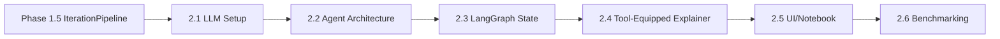

# Agentic Simulation Framework - Technical Specification (SPEC_DEV.md)

## 1. Overview
This framework provides an autonomous loop for generating, testing, and refining specific trading strategies using `abides-rohan`. It leverages **LangGraph** for state management, **PostgreSQL** for relational data storage, and **Docker** for isolated execution.

## 2. Core Architecture

### 2.1 Technology Stack (subject to change)
*   **Orchestration:** LangGraph (Python)
*   **Simulation Engine:** abides-rohan (Existing)
*   **Database:** PostgreSQL
    *   *Features:* Relational Tables for Metrics/Logs/Series, BYTEA for Images/Code.
*   **LLM Integration:** Via `langchain` connectors or `OpenRouter` API. For example:
    *   *Analysis:* Google Gemini 1.5 Pro (via `langchain-google-genai`)
    *   *Code Generation:* Claude 3.5 (via `langchain-openai` / OpenRouter)
*   **Execution:** LLM-generated code is executed in Docker containers (via `docker-py`) or using secure Python interpreters (e.g. [`pydantic/monty`](https://github.com/pydantic/monty)).

### 2.2 System Components & Communication

The system follows a directed graph architecture where the Manager acts as the central orchestrator.

**Communication Protocol:**
*   **Control Flow (LangGraph):**
    *   **Persistence:** Uses `PostgresSaver` to checkpoint agent state (messages, current code, decision processing) synchronously. This allows the UI to query the exact status of any session.
    *   **Real-time Streaming:** The Manager API exposes a **WebSocket/SSE Endpoint**. It streams generic `LangGraph` events (Node Start/End) and custom application events (e.g., "Validation Error", "Simulation Progress 50%") directly to the UI.
*   **Data Flow (Bulk Storage):**
    *   **Simulation Artifacts:** Heavy data (ticks, order books) is handled via **Async Persistence**. The `SimulationNode` triggers a background write to PostgreSQL.
    *   **Lazy Loading:** The UI/Agents receive a `SimulationResult` containing *aggregate metrics* (Pydantic) and a *RunID*. If they need detailed series data, they request it via the RunID (Lazy Load).

## 3. Data Models

### 3.1 Strategic Agent Protocol (Framework Agnostic)
Defined in [src/rohan/simulation/models/strategy_api.py](../src/rohan/simulation/models/strategy_api.py). This is the **ONLY** interface the LLM interacts with.

**Units & Conventions (matching ABIDES):**
*   **Prices:** `int`, in **cents** (e.g. `18550` = $185.50).
*   **Quantities:** `int`, in **shares**.
*   **Cash:** `int`, in **cents**.
*   **Timestamps:** `int`, nanoseconds since epoch.

It defines:
*   `MarketState`: The agent's view of the market (prices, inventory, orders). All monetary fields are `int` cents.
*   `OrderAction`: The actions the agent can take. Includes a `@model_validator` enforcing:
    *   `LIMIT` orders **must** specify a `price`.
    *   `MARKET` orders **must not** specify a `price`.
*   `StrategicAgent` Protocol: The interface (`initialize`, `on_market_data`, `on_order_update`) that generated strategies must implement.

### 3.2 Data Exchange Objects (DXOs)
To balance type safety within the Agent Logic and performance for Simulation Data, we use a tiered approach:

1.  **Metadata & Summaries (Pydantic):**
    *   `SimulationSummary`: Lightweight object containing aggregate KPIs (PnL, Sharpe, Max Drawdown). Safe to serialize and pass to LLMs/UI.
    *   `StrategyEvaluation`: Contains the code, the summary, and the LLM's reasoning.
2.  **Bulk Data (Typed DataFrames via Pandera):**
    *   `SimulationOutput` (DAO): An abstract interface (`ABC`) that provides access to bulk data (Order Books, Logs). Return types are annotated with `pandera.typing.DataFrame[Schema]`.
    *   **Schema Definitions:** Defined in [src/rohan/simulation/models/schemas.py](../src/rohan/simulation/models/schemas.py) using `pandera.DataFrameModel`:
        *   `OrderBookL1Schema`: `time`, `bid_price`, `bid_qty`, `ask_price`, `ask_qty`, `timestamp`. `strict=False` to allow downstream-computed columns (e.g. `mid_price`).
        *   `OrderBookL2Schema`: `time`, `level`, `side`, `price`, `qty`, `timestamp`. `side` is constrained to `{"bid", "ask"}`, `level >= 1`.
        *   `AgentLogsSchema`: `AgentID`, `AgentType`, `EventType`. `strict=False` because upstream `parse_logs_df` may add extra columns.
    *   **Validation Strategy:** Schemas are validated at the *production boundary* — i.e. in `AbidesOutput` (concrete `SimulationOutput`) right after data is computed and before it is cached. Consumers (e.g. `AnalysisService`) rely on annotations for documentation without re-validating.
    *   **Transport:** Internally passed as `pd.DataFrame`. Over network/API, served as **Parquet** or **Arrow** streams, referenced by `RunID`.

### 3.3 Database Schema (PostgreSQL/SQLite)
Defined in [src/rohan/framework/database/models.py](../src/rohan/framework/database/models.py).

**Hierarchy:**
`StrategySession` (User goal) -> `StrategyIteration` (One code version) -> `SimulationScenario` (Conditions) -> `SimulationRun` (Execution).

**Key Tables:**
*   `strategy_sessions`: High-level user goal.
*   `simulation_scenarios`: Configuration overrides for different test cases.
*   `strategy_iterations`: Generated Python code versions.
*   `simulation_runs`: Execution results linked to iteration and scenario.
*   `market_data_l1`: High-frequency L1 order book data.
*   `agent_logs`: Detailed agent actions and events.
*   `artifacts`: Binary storage for plots and log files.

## 4. Workflows

### 4.1 Phase 1: The "Observer" (Running Baselines on Existing Agents)
**Goal:** Verify the system can run simulations, capture data, and provide intelligent analysis without injecting new strategy code yet.

1.  **Session Initialization**: User requests analysis. System creates session and scenarios.
2.  **Orchestration**: Manager triggers generic runs.
3.  **Execution**: `SimulationNode` runs simulations, extracts data, computes metrics, and persists to DB.
4.  **Analysis**: `ResultAnalyzer` retrieves metrics and plots, uses LLM to generate a report explaining observed dynamics.

### 4.2 Phase 2: The "Strategist" (Iterative Refinement)
**Goal:** Autonomous strategy generation and improvement loops.

1.  **Strategy Generation**: LLM generates Python code implementing `StrategicAgent`.
2.  **Validation**: Code is validated via AST (no dangerous imports).
3.  **Scenario Testing**: System runs simulation with new code injected.
4.  **Evaluation**: Compare against baseline or previous iteration.
5.  **Refinement**: Feedback loop to generate next iteration if needed.

## 5. Implementation Status & Roadmap

### ✅ CHECKPOINT: Phase 1 & 1.5 Foundations

Phase 1 (Data/Execution) and Phase 1.5 (Vertical Prototype) establish the core capabilities.

#### Phase 1.1: Database, Schemas, and Models ✅
**Status:** Complete and tested.
*   Pydantic schemas in `src/rohan/simulation/models/`.
*   **Pandera DataFrame schemas** in `src/rohan/simulation/models/schemas.py` (`OrderBookL1Schema`, `OrderBookL2Schema`, `AgentLogsSchema`).
*   SQLAlchemy models in `src/rohan/framework/database/models.py`.
*   DB Connection in `src/rohan/framework/database/database_connector.py`.
*   Repository Layer in `src/rohan/framework/repository.py`.
*   Initialization scripts in `src/rohan/framework/database/init_db.py`.

#### Phase 1.2: Execution Engine ✅
**Status:** Complete and tested.
*   `SimulationEngine` in `src/rohan/framework/simulation_engine.py` orchestrates local execution and persistence.

#### Phase 1.3: Analysis Service ✅
**Status:** Complete and tested.
*   `AnalysisService` in `src/rohan/framework/analysis_service.py` computes metrics and generates Matplotlib plots.

#### Phase 1.4: Framework Hardening ✅
**Status:** Complete and tested.
Technical debt verification and cleanup.

**Tasks:**
- [x] **Session Management**: Use `scoped_session` and ensure proper cleanup. — `DatabaseConnector` now uses `scoped_session` with `remove_session()` for thread-safe, leak-free session management.
- [x] **Schema Fixes**:
    - [x] `SimulationRun` status enum. — `RunStatus` enum (`PENDING`, `RUNNING`, `COMPLETED`, `FAILED`, `CANCELLED`).
    - [x] Add `error_message`, `error_traceback` to `SimulationRun`. — Both `Text` columns, populated on failure.
    - [x] Add timestamps (`created_at`, `updated_at`). — `server_default=func.now()`, `onupdate=func.now()` on all relevant tables.
    - [x] Add cascade delete to relationships. — `cascade="all, delete-orphan"` + `ondelete="CASCADE"` on all FK relationships.
- [x] **Missing Indexes**: Add indexes for frequently queried fields (`agent_type`, `event_type`, `status`). — `ix_agent_logs_agent_type`, `ix_agent_logs_event_type`, `ix_simulation_runs_status`.
- [x] **Artifact Storage**: Refactor to support file-system or S3 backed storage (currently DB-only). — `ArtifactStore` accepts `artifact_root` for filesystem backend; `Artifact` model has `storage_backend` and `ArtifactType` enum.
- [x] **Logging**: Replace `print()` with `logging` module. — All `print()` calls replaced with `logging.getLogger(__name__)` across `init_db.py`, `database_connector.py`, `simulation_engine.py`, `repository.py`.
- [x] **Metrics**: Improve handling of missing metrics (None vs 0.0). — All metric fields are now `float | None`; `None` = "not computed".
- [x] **Plot Pipeline**: Implement `figure_to_bytes` and ensure plots are saved as artifacts during runs. — `AnalysisService.figure_to_bytes()` returns raw PNG bytes; `SimulationEngine.run_local()` auto-saves price/volume/spread plots as artifacts.

#### Phase 1.5: Minimal Vertical Prototype
**Goal:** Validate key interfaces and interpreter loop.

*   **1.5.1 StrategicAgent API Redesign** ✅
    *   Defined in [src/rohan/simulation/models/strategy_api.py](../src/rohan/simulation/models/strategy_api.py).
    *   Mapped to ABIDES internals.

*   **1.5.2 ABIDES Adapter & Injection** ✅
    *   Implemented in [src/rohan/simulation/abides_impl/strategic_agent_adapter.py](../src/rohan/simulation/abides_impl/strategic_agent_adapter.py).
    *   Allows dynamic injection of strategies.

*   **1.5.3 Sandboxed Execution** ✅
    *   Implemented in [src/rohan/simulation/strategy_validator.py](../src/rohan/simulation/strategy_validator.py).
    *   AST validation and restricted environment execution.

*   **1.5.4 Agent-Specific KPIs** ✅
    *   Implemented in `src/rohan/simulation/models/simulation_metrics.py`.
    *   **`SimulationMetrics`:** Market-wide metrics — `volatility` (annualised), `mean_spread`, `effective_spread`, `avg_bid_liquidity`, `avg_ask_liquidity`, `traded_volume`. Monetary averages are `float | None` in cents (None = not yet computed).
    *   **`AgentMetrics`:** Per-agent — `initial_cash` (`int`, cents), `ending_cash` (`int`, cents), `total_pnl` (`float | None`, cents — fractional from mid-price), `sharpe_ratio`, `max_drawdown`, `inventory_std`, `trade_count`, `fill_rate`, `order_to_trade_ratio`, inventory fields.
    *   **`MarketMetrics`:** Same shape as `SimulationMetrics` for baseline comparison.
    *   **`MarketImpact`:** Typed Pydantic model (not `dict`) with `spread_delta_pct`, `volatility_delta_pct`, `bid_liquidity_delta_pct`, `ask_liquidity_delta_pct`.
    *   **`ComparisonResult`:** Uses `MarketImpact` (typed) for `market_impact` field.
    *   Volatility annualisation derives observation frequency from actual median timestamp intervals, not a hard-coded assumption.

*   **1.5.5 Structured Summary for LLM** ✅
    *   `RunSummary` model and `generate_summary` in `analysis_service.py`.
    *   Prompt templates in `src/rohan/framework/prompts.py`.

*   **1.5.6 Single Iteration Pipeline** ✅
    *   Implemented in [src/rohan/framework/iteration_pipeline.py](../src/rohan/framework/iteration_pipeline.py).
    *   `IterationPipeline.run()` wires validate → execute (strategy + baseline) → analyse → persist → interpret.
    *   `PipelineConfig` for knobs (settings, baseline overrides, persistence toggle, goal description).
    *   `IterationResult` Pydantic model with `validation`, `comparison`, `summary`, `interpreter_prompt`, and `.success` property.
    *   Optional DB persistence of iterations, runs, and chart artifacts.
    *   Entry point for the "Game Loop" (Phase 2).

### 🚧 TODO: Phase 2 - LangGraph Orchestration

Phase 2 implements the autonomous agent loop using LangGraph.

#### Step 2.1: LLM Integration MVP
**Status:** TODO.
**Goal:** Run a strategy, gather metrics, and have an LLM interpret the results.

##### 2.1.1 LangChain Model Setup
Use **LangChain** for model abstraction.

*   **Add dependencies** to `pyproject.toml`:
    ```toml
    [project.optional-dependencies]
    llm = [
        "langchain>=0.3",
        "langchain-openai>=0.2",
        "langchain-google-genai>=2.0",
        "langgraph>=0.2",
    ]
    ```
*   **Create `src/rohan/llm/__init__.py`** — LLM module.
*   **Create `src/rohan/llm/factory.py`** — Model factory using LangChain.
*   **Create `src/rohan/config/llm_settings.py`** — Pydantic settings.

**File Structure:**
```
src/rohan/llm/
├── __init__.py
├── factory.py          # LangChain model factory
├── models.py           # Pydantic response models
└── prompts.py          # Prompt templates
```

---

#### Step 2.2: Multi-Agent Architecture

**Design Principle:** Each agent is a separate LangGraph node with a single responsibility. Agents communicate through state, not direct calls.

##### Agent Topology


##### 2.2.1 Writer Agent
**Role:** Generate strategy code from goal + feedback.

*   **Input:** Goal description, previous feedback (if any).
*   **Output:** Python strategy code.
*   **LangGraph node:** `writer_node`.

##### 2.2.2 Validator Agent
**Role:** Validate strategy code (AST + sandbox execution).

*   **Input:** Strategy code.
*   **Output:** Valid flag, error message (if any).
*   **Loop:** If invalid, return error to Writer. **Failsafe:** Max 3 retries.
*   **Implementation:** Uses existing `StrategyValidator` + optional LLM self-critique.
*   **LangGraph node:** `validator_node`.

##### 2.2.3 Scenario Executor
**Role:** Run validated strategy across multiple scenarios.

*   **Input:** Validated strategy code, list of scenario configs.
*   **Output:** List of `SimulationOutput` + `SimulationMetrics` per scenario.
*   **Scalability:** Currently runs single pre-defined scenario, but architecture supports:
    - Pre-defined scenario list
    - Dynamic scenario selection (future: agent-driven)
*   **LangGraph node:** `scenario_executor_node`.

##### 2.2.4 Explainer Agent (per scenario)
**Role:** Analyze simulation results with tool access.

*   **Input:** `SimulationOutput`, `SimulationMetrics`, `RunSummary`.
*   **Tools available:**
    - `get_order_book_snapshot(timestamp)` — Query L1 data.
    - `get_agent_trades(agent_id)` — Get trade history.
    - `compute_pnl_curve()` — Generate PnL over time.
    - `plot_price_series()` — Generate chart.
    - `query_dataframe(query)` — Pandas query on logs.
*   **Output:** `ScenarioExplanation` with insights, charts, recommendations.
*   **LangGraph node:** `explainer_node` (runs per scenario, can parallelize).

##### 2.2.5 Aggregator
**Role:** Combine all scenario explanations into unified feedback.

*   **Input:** List of `ScenarioExplanation`.
*   **Output:** Aggregated feedback for Writer (cross-scenario patterns, overall assessment).
*   **LangGraph node:** `aggregator_node`.

---

#### Step 2.3: LangGraph State & Graph

##### State Schema
```python
class IterationSummary(BaseModel):
    """Summary of a single iteration for history tracking."""
    iteration_number: int
    strategy_code: str
    scenario_metrics: dict[str, ScenarioMetrics]  # scenario_name -> metrics
    aggregated_explanation: str
    judge_score: float | None  # 1-10 from LLM judge
    judge_reasoning: str | None
    timestamp: datetime

class RefinementState(TypedDict):
    goal: str
    current_code: str | None
    validation_errors: list[str]
    validation_attempts: int
    scenarios: list[ScenarioConfig]
    scenario_results: list[ScenarioResult]
    explanations: list[ScenarioExplanation]
    iterations: list[IterationSummary]  # ← Full iteration history
    aggregated_feedback: str | None
    iteration_number: int
    max_iterations: int
    status: Literal["writing", "validating", "executing", "explaining", "aggregating", "done", "failed"]
```

##### Convergence Assessment (LLM-as-Judge)

The **Aggregator** evaluates each iteration against the goal and previous iterations.

**Judge Input (Prompt):**
```
## Goal
{goal}

## Previous Iterations
| Iter | PnL | Volatility Δ | Spread Δ | Score | Summary |
|------|-----|--------------|----------|-------|---------|
| 1    | -$50 | +12%        | +5%      | 3/10  | High market impact... |
| 2    | +$20 | +8%         | +2%      | 5/10  | Improved but still... |

## Current Iteration (3)
[Current metrics and scenario explanations]

## Task
1. Score this iteration (1-10) relative to the GOAL
2. Compare to previous iterations — is it improving?
3. Recommend: continue, stop (converged), or stop (no progress)
```

**Judge Output (Structured):**
```python
class JudgeVerdict(BaseModel):
    score: float  # 1-10
    comparison: Literal["better", "worse", "similar"]
    reasoning: str
    recommendation: Literal["continue", "stop_converged", "stop_plateau"]
```

**Convergence Criteria:**
- `stop_converged`: Score ≥ 8 and improvement plateaued
- `stop_plateau`: Score similar for 3+ iterations
- `continue`: Otherwise, keep refining

##### Graph Definition
```python
from langgraph.graph import StateGraph, END

def build_refinement_graph():
    graph = StateGraph(RefinementState)

    # Nodes
    graph.add_node("writer", writer_node)
    graph.add_node("validator", validator_node)
    graph.add_node("executor", scenario_executor_node)
    graph.add_node("explainer", explainer_node)  # Runs for each scenario
    graph.add_node("aggregator", aggregator_node)

    # Edges
    graph.add_edge("writer", "validator")
    graph.add_conditional_edges("validator", validation_router, {
        "retry": "writer",      # Invalid + retries left
        "execute": "executor",  # Valid
        "fail": END,            # Max retries exceeded
    })
    graph.add_edge("executor", "explainer")
    graph.add_edge("explainer", "aggregator")
    graph.add_conditional_edges("aggregator", should_continue, {
        "continue": "writer",   # More iterations
        "done": END,            # Converged or max iterations
    })

    graph.set_entry_point("writer")
    return graph.compile()
```

---

#### Step 2.4: Tool-Equipped Explainer

The Explainer agent needs **tool calling** to deeply analyze simulation results.

##### Tool Definitions
*   **Create `src/rohan/llm/tools.py`** — LangChain tools wrapping analysis functions:
    ```python
    from langchain_core.tools import tool

    @tool
    def get_agent_trades(agent_id: int, output: SimulationOutput) -> list[dict]:
        """Get all trades executed by a specific agent."""
        ...

    @tool
    def compute_volatility_window(start_ts: int, end_ts: int) -> float:
        """Compute price volatility in a time window."""
        ...

    @tool
    def plot_metric(metric: str) -> str:
        """Generate a chart for a metric. Returns base64 PNG."""
        ...
    ```

##### Explainer as ReAct Agent
```python
from langgraph.prebuilt import create_react_agent

def create_explainer_agent(model: BaseChatModel):
    tools = [get_agent_trades, compute_volatility_window, plot_metric, ...]
    return create_react_agent(model, tools, state_schema=ExplainerState)
```

---

#### Step 2.5: UI & Notebook for Local Testing
**Status:** TODO.

*   **Create `notebooks/quickstart.ipynb`** — Interactive demo.
*   **Add "Strategy" tab** — Code editor for strategy input.
*   **Add "Interpretation" panel** — Display agent feedback.
*   **Add "Scenario Results" view** — Per-scenario metrics and explanations.

**UV Scripts:**
```toml
[tool.uv.scripts]
ui = "streamlit run src/rohan/ui/app.py"
notebook = "jupyter lab notebooks/"
```

---

#### Step 2.6: LLM Feedback Benchmarking
**Status:** TODO.

*   **Create `src/rohan/llm/eval/`** — Evaluation module.
*   **Create `notebooks/llm_benchmark.ipynb`** — Compare providers.
*   **Document findings** in `docs/llm_evaluation.md`.

---

**MVP Scope (Step 2.1-2.4):**
1. Writer + Validator loop (3 retries)
2. Single pre-defined scenario
3. Single Explainer agent with basic tools
4. Aggregator returns feedback to Writer
5. 1-3 refinement iterations

**Future Extensions:**
- Multiple scenarios in parallel
- Agent-driven scenario selection
- Advanced tool suite for Explainer
- Persistent checkpointing

**Dependencies & Order:**


**Estimated Timeline:**
| Step | Effort | Notes |
|------|--------|-------|
| 2.1 | 1 day | LangChain setup |
| 2.2 | 2-3 days | Agent nodes implementation |
| 2.3 | 1-2 days | LangGraph wiring |
| 2.4 | 2-3 days | Tools + ReAct explainer |
| 2.5 | 1-2 days | UI updates |
| 2.6 | 2-3 days | Benchmarking |

### 🚧 TODO: Phase 3 - Docker Sandbox
**Status:** Deferred.
*   Docker container for untrusted code execution.

### 🚧 TODO: Phase 4 - Production Features
**Status:** Deferred.
*   Web UI, Dashboards, Leaderboards.
