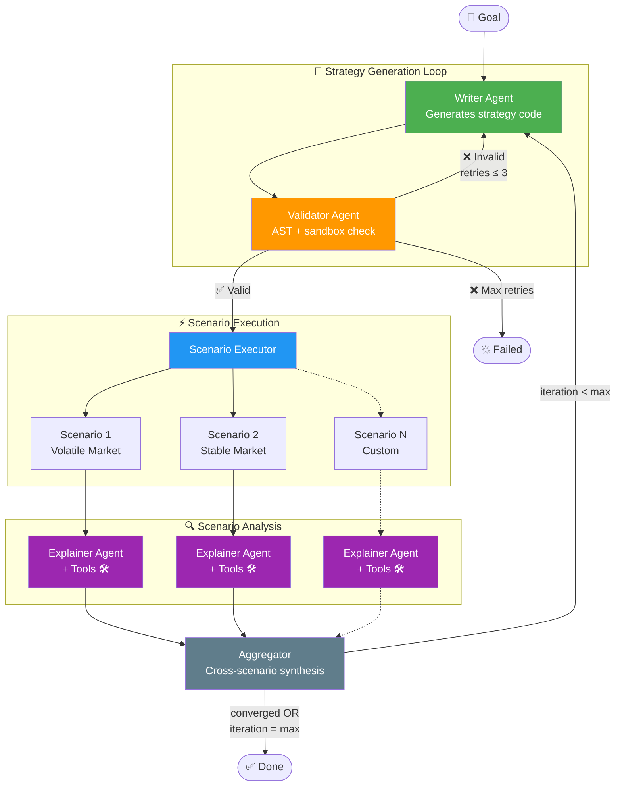

# ROHAN — Technical Architecture

> **Audience:** Developers and contributors working on the ROHAN codebase.
> **Last verified:** v0.3.1 (2026-04-06).

---

## 1. Overview

ROHAN is an autonomous loop for generating, testing, and refining algorithmic
trading strategies. It uses **LangGraph** for state management,
**`abides-hasufel`** as the high-fidelity market simulator, **SQLAlchemy** for
persistence (SQLite by default, PostgreSQL optional), and **Streamlit** for the
user interface.

## 2. Technology Stack

| Layer | Technology | Notes |
|-------|-----------|-------|
| **Orchestration** | LangGraph (Python) | Directed state-machine graph |
| **Simulation** | `abides-hasufel` v2.5.8 | Discrete-event LOB simulator (fork of JP Morgan ABIDES) |
| **LLM Integration** | LangChain + OpenRouter | Model-agnostic; any OpenAI-compatible endpoint works |
| **Persistence** | SQLAlchemy ORM | SQLite default; `DATABASE_URL` for PostgreSQL |
| **UI** | Streamlit (multipage) | Terminal (simulation explorer) + Refinement Lab |
| **Strategy Sandbox** | AST validation + `ThreadPoolExecutor` | Rejects unsafe imports/constructs; timeout-bounded execution |
| **Quality** | ruff, pyright, pytest, hypothesis, pre-commit | CI via GitHub Actions |

## 3. Module Map

```
src/rohan/
├── config/           # Pydantic settings hierarchy (sim, LLM, DB, features)
├── simulation/       # ABIDES integration
│   ├── config_builder.py         # SimulationSettings → hasufel SimulationBuilder
│   ├── hasufel_output.py         # HasufelOutput (SimulationOutput concrete impl)
│   ├── strategic_agent_adapter.py # StrategicAgent ↔ ABIDES TradingAgent bridge
│   ├── strategic_agent_config.py  # @register_agent("rohan_strategy")
│   └── models/                   # strategy_api.py, schemas.py, simulation_metrics.py
├── framework/        # Analysis, persistence, iteration pipeline
│   ├── analysis_service.py       # Metrics, charts, RichAnalysisBundle
│   ├── analysis_models.py        # FillRecord, PnLPoint, L2Snapshot, etc.
│   ├── simulation_engine.py      # Orchestrates single runs + baseline comparisons
│   ├── iteration_pipeline.py     # Non-LLM refinement loop (legacy)
│   ├── database/                 # ORM models, connector, init_db
│   ├── repository.py             # Session CRUD
│   └── prompts.py                # Interpreter prompt formatting
├── llm/              # Agentic graph
│   ├── graph.py                  # build_refinement_graph() — LangGraph definition
│   ├── nodes.py                  # Writer, Validator, Executor, Explainer, Aggregator
│   ├── state.py                  # RefinementState TypedDict
│   ├── models.py                 # Structured output models (ScenarioExplanation, etc.)
│   ├── scoring.py                # 6-axis deterministic scoring
│   ├── tools.py                  # 8 investigation tools for Explainer ReAct agent
│   ├── scenario_tools.py         # 3 scenario tools for Planner agent
│   ├── planner.py                # Pre-graph adversarial scenario planner
│   ├── factory.py                # LLM model factory (provider dispatch)
│   ├── prompts.py                # System/human prompt templates
│   ├── telemetry.py              # Structured JSON telemetry
│   └── cli.py                    # `uv run refine` CLI entry point
└── ui/               # Streamlit pages
    ├── 0_Terminal.py             # Simulation explorer
    └── 1_Refinement_Lab.py       # LLM refinement UI
```

## 4. Data Flow

### 4.1 Refinement Loop

```
User goal (natural language)
    │
    ▼
[Planner] ─── proposes adversarial scenarios (optional)
    │
    ▼
┌─→ [Writer] ─── generates StrategicAgent Python code
│       │
│       ▼
│   [Validator] ─── AST safety check + sandbox execution
│       │ ❌ retry (≤3)
│       ▼ ✅
│   [Scenario Executor] ─── runs strategy in abides-hasufel
│       │                    per scenario: HasufelOutput → RichAnalysisBundle
│       │                    generates 6 charts (Price, Spread, Volume, PnL, Inventory, Fills)
│       ▼
│   [Explainer] ─── ReAct agent with 8 investigation tools
│       │            falls back to single structured-output call on failure
│       ▼
│   [Aggregator] ─── deterministic 6-axis scoring + LLM qualitative analysis
│       │
│       ├── converged / max iterations → DONE
└───────┘  regression → rollback; else → next iteration
```

### 4.2 Data Contracts

| Boundary | Format | Rationale |
|----------|--------|-----------|
| Simulator → Executor node | `HasufelOutput` (live Python) | Access to typed `SimulationResult` |
| Executor → Explainer | `RichAnalysisBundle` (JSON string) | Checkpoint-safe, container-independent |
| Explainer → Aggregator | `ScenarioExplanation` (Pydantic) | Structured qualitative analysis |
| Aggregator → DB | `ScenarioMetrics` → `RefinementScenarioResult` ORM | Full round-trip persistence |

### 4.3 Strategy Protocol

Defined in `src/rohan/simulation/models/strategy_api.py`. This is the **only**
interface the LLM-generated code implements.

- **Units:** prices in integer cents, quantities in shares, cash in cents, timestamps in nanoseconds.
- **`MarketState`:** L1/L2 book data, portfolio, liquidity, time remaining, open orders. `mid_price` and `spread` are `@computed_field`s.
- **`OrderAction`:** Discriminated union (`PLACE`, `CANCEL`, `CANCEL_ALL`, `MODIFY`, `PARTIAL_CANCEL`, `REPLACE`). Validated by `@model_validator`.
- **`StrategicAgent` Protocol:** `initialize`, `on_tick`, `on_market_data`, `on_order_update`, `on_simulation_end`.

### 4.4 Database Schema

Defined in `src/rohan/framework/database/models.py`. Hierarchy:

`StrategySession` → `StrategyIteration` → `SimulationScenario` → `SimulationRun`

Supporting tables: `market_data_l1`, `agent_logs`, `artifacts`.

### 4.5 DataFrame Schemas (Pandera)

Validated at the production boundary in `HasufelOutput`:
- `OrderBookL1Schema`, `OrderBookL2Schema`, `AgentLogsSchema` (in `schemas.py`)

## 5. Implementation Details

### 5.1 Foundations (Data & Execution)
*   **Database, Schemas, and Models:**
    *   Pydantic schemas in `src/rohan/simulation/models/`.
    *   Pandera DataFrame schemas in `src/rohan/simulation/models/schemas.py` (`OrderBookL1Schema`, `OrderBookL2Schema`, `AgentLogsSchema`).
    *   SQLAlchemy models in `src/rohan/framework/database/models.py`.
    *   DB Connection in `src/rohan/framework/database/database_connector.py`.
    *   Repository Layer in `src/rohan/framework/repository.py`.
    *   Initialization scripts in `src/rohan/framework/database/init_db.py`.
*   **Execution Engine:** `SimulationEngine` in `src/rohan/framework/simulation_engine.py` orchestrates local execution and persistence.
*   **Analysis Service:** `AnalysisService` in `src/rohan/framework/analysis_service.py` computes metrics and generates Matplotlib plots.
*   **Framework Hardening:**
    *   **Session Management:** Uses `scoped_session` and ensures proper cleanup.
    *   **Schema Fixes:** `SimulationRun` status enum, error tracking, timestamps, cascade deletes.
    *   **Indexes:** Added for frequently queried fields.
    *   **Artifact Storage:** Supports file-system or S3 backed storage.
    *   **Logging:** Uses `logging` module.
    *   **Metrics:** Handles missing metrics (None vs 0.0).
    *   **Plot Pipeline:** `figure_to_bytes` ensures plots are saved as artifacts.

### 5.2 Minimal Vertical Prototype
*   **StrategicAgent API Redesign:** Defined in `src/rohan/simulation/models/strategy_api.py`. Mapped to ABIDES internals.
*   **ABIDES Adapter & Injection:** Implemented in `src/rohan/simulation/abides_impl/strategic_agent_adapter.py`. Wraps a `StrategicAgent` inside an ABIDES `TradingAgent`. Translates ABIDES events to protocol callbacks, builds `MarketState` snapshots (including portfolio valuation, liquidity, time remaining), dispatches `OrderAction`s via `match` on `OrderActionType` (with handlers for place, modify, partial-cancel, replace), and forwards order lifecycle events (`order_accepted`, `order_modified`, `order_partial_cancelled`, `order_replaced`, `market_closed`) to the strategy.
*   **Sandboxed Execution:** Implemented in `src/rohan/simulation/strategy_validator.py`. AST validation and restricted environment execution.
*   **Agent-Specific KPIs:** Implemented in `src/rohan/simulation/models/simulation_metrics.py`.
*   **Structured Summary for LLM:** `RunSummary` model and `generate_summary` in `analysis_service.py`. Prompt templates in `src/rohan/framework/prompts.py`.
*   **Single Iteration Pipeline:** Implemented in `src/rohan/framework/iteration_pipeline.py`.

### 5.3 LangGraph Orchestration

#### 5.3.1 LLM Integration
Uses **LangChain** for model abstraction with **OpenRouter** as default provider.

*   **Dependencies** in `pyproject.toml`:
    *   Core: `langchain>=0.3`, `langchain-openai>=0.2`, `langgraph>=1.0.8`
    *   Optional: `[llm]` extra includes `langchain-google-genai>=2.0`
*   **`src/rohan/llm/__init__.py`** — LLM module init.
*   **`src/rohan/llm/factory.py`** — Model factory with provider dispatch.
*   **`src/rohan/config/llm_settings.py`** — Pydantic settings.
*   **`src/rohan/llm/models.py`** — Pydantic structured output models.
*   **`src/rohan/llm/prompts.py`** — Prompt templates.
*   **`src/rohan/llm/tools.py`** — `make_investigation_tools(rich_json)` — factory producing 8 parameterized tools from serialized `RichAnalysisBundle`.
*   **`src/rohan/framework/analysis_models.py`** — Pydantic models for rich simulation data (`FillRecord`, `PnLPoint`, `InventoryPoint`, `OrderLifecycleRecord`, `CounterpartySummary`, `MidPricePoint`, `L2Snapshot`, `RichAnalysisBundle`).

#### 5.3.2 Multi-Agent Architecture
Each agent is a separate LangGraph node with a single responsibility. Agents communicate through state, not direct calls.



*   **Writer Agent:** Generates strategy code from goal + feedback. Receives a `{scenario_context}` block describing the scenarios the strategy will face (names, regime tags, templates, planner rationale) so it can write robustly for multiple market conditions.
*   **Validator Agent:** Validates strategy code (AST + sandbox execution).
*   **Scenario Executor:** Runs validated strategy across multiple scenarios. Computes `RichAnalysisBundle` → serialized JSON on `ScenarioResult`. Populates `regime_context` from scenario config overrides (regime tags, template name) for the explainer. Extracts `vwap_cents` from `AgentMetrics` and computes `avg_slippage_bps` from fill records.
*   **Explainer Agent:** ReAct agent (`create_react_agent`) with 8 parameterized investigation tools that work from serialized `RichAnalysisBundle` JSON. Receives `regime_context` describing the scenario's market regime. Prompt includes guidance for multi-window adverse selection interpretation, VWAP comparison, and fill slippage analysis. Produces `ScenarioExplanation` structured output. Falls back to single structured-output call on failure.
*   **Aggregator:** Scores each iteration deterministically via 6-axis formulas (`scoring.py`), uses LLM only for qualitative analysis. The aggregator prompt includes a scoring formula reference section so the LLM can explain why each axis scored as it did. Handles rollback on regression (>1.0 score drop) and convergence/plateau detection.

#### 5.3.3 LangGraph State & Graph
Implemented in `src/rohan/llm/state.py` and `src/rohan/llm/graph.py`.
The **Aggregator** scores each iteration using deterministic formulas across 6 axes (profitability, risk, volatility impact, spread impact, liquidity impact, execution quality). The execution quality axis incorporates fill rate, order-to-trade ratio, and average fill slippage (`avg_slippage_bps`). The LLM provides qualitative analysis only — reasoning, strengths, weaknesses, and recommendations via the `QualitativeAnalysis` structured output. The aggregator prompt includes a scoring formula reference so the LLM can ground its explanations in the actual scoring mechanics. Convergence, plateau detection, comparison, and rollback are all deterministic.

**Key state fields on `ScenarioResult`:**
- `vwap_cents` — volume-weighted average fill price (from `AgentMetrics`)
- `avg_slippage_bps` — mean signed slippage across fills (computed from `RichAnalysisBundle`)
- `regime_context` — market regime description from scenario config overrides

**Key state fields on `ScenarioMetrics`** (history persistence):
- `avg_slippage_bps` — carried from `ScenarioResult` for iteration history table

**Iteration history table** columns: Iter, PnL, Trades, Fill Rate, Slippage, Vol Δ, Spread Δ, Score, Summary.

#### 5.3.4 Tool-Equipped Explainer (ReAct Agent)

The Explainer agent is a **ReAct agent** (built with `create_react_agent` from `langgraph.prebuilt`) that investigates simulation results through parameterized tool calling. This is the core architectural investment for interpretation depth.

**Data flow — enriched serializable bundle:**

```
SimulationOutput (live, in ABIDES process)
    │
    ▼
compute_rich_analysis()  →  RichAnalysisBundle (Pydantic)
    │
    ▼
.model_dump_json()  →  ScenarioResult.rich_analysis_json (str)
    │
    ▼
make_investigation_tools(rich_json)  →  8 closure-bound tools
    │
    ▼
create_react_agent(model, tools, prompt, response_format=ScenarioExplanation)
    │
    ▼
ScenarioExplanation (structured output)
```

`SimulationOutput` is consumed and discarded in the executor node. Only the serialized JSON bundle crosses node boundaries. This ensures:
- **Checkpoint safety**: LangGraph state is fully JSON-serializable
- **Container independence**: explainer can run in a separate process or container
- **Re-explainability**: any `ScenarioResult` with `rich_analysis_json` can be re-analyzed without re-running the simulation

**`RichAnalysisBundle`** (defined in `analysis_models.py`) contains:

| Field | Type | Purpose |
|-------|------|---------|
| `fills` | `list[FillRecord]` | Per-fill execution data (timestamp, side, price, qty, slippage, counterparty) |
| `pnl_curve` | `list[PnLPoint]` | Mark-to-market PnL trajectory (dense L1-sampled via hasufel `compute_equity_curve`) |
| `inventory_trajectory` | `list[InventoryPoint]` | Position buildup/unwinding over time |
| `adverse_selection_bps` | `float | None` | Avg mid-price move against fill direction (default window) |
| `adverse_selection_by_window` | `dict[str, float]` | Multi-window adverse selection (100ms, 500ms, 1s, 5s) |
| `counterparty_breakdown` | `list[CounterpartySummary]` | Who the strategy traded against |
| `order_lifecycle` | `list[OrderLifecycleRecord]` | Order submission/fill/cancel statistics (from hasufel `OrderLifecycle` model) |
| `mid_price_series` | `list[MidPricePoint]` | Full L1 mid-price time-series (tool recomputation) |
| `l2_snapshots` | `list[L2Snapshot]` | Sampled L2 snapshots at fills, PnL turning points, ~5s intervals (capped at 200) |

**Investigation tools** (`make_investigation_tools` in `tools.py`):

| Tool | Key parameters | Returns |
|------|----------------|---------|
| `query_fills` | `start_ns`, `end_ns`, `side`, `limit` | Filtered fills with slippage |
| `query_pnl_curve` | `start_ns`, `end_ns`, `limit` | PnL points in time range |
| `query_inventory` | `start_ns`, `end_ns`, `limit` | Position trajectory in time range |
| `query_adverse_selection` | `window_label` | Per-window or all-window adverse selection |
| `query_book_at_time` | `timestamp_ns`, `n_levels` | Nearest L2 snapshot |
| `query_counterparties` | — | Agent-type breakdown |
| `query_order_lifecycle` | `status`, `limit` | Filtered order records |
| `get_simulation_summary` | — | High-level statistics |

Tools return human-readable strings. Parameterized filters (time-range, side, status) enable targeted investigation.

**Fallback:** On ReAct agent failure, the node falls back to a single structured-output LLM call (pre-Step 9 behavior), ensuring the pipeline never breaks.

**Architecture decision:** `SimulationOutput` is NOT stored in `RefinementState`. It depends on live ABIDES objects, is not JSON-serializable, and would break checkpointing, replay, and container scaling. The enriched bundle approach (Option A) was chosen over co-located explainer (Option B) and full `SimulationOutput` proxy (Option C) to ensure container independence and deterministic analysis.

#### 5.3.4.1 Chart & Analysis Persistence Pipeline

Six base64-encoded PNG charts are generated per scenario in the executor node:

| Chart | Field | Category |
|-------|-------|----------|
| Price Series | `price_chart_b64` | Market microstructure |
| Bid-Ask Spread | `spread_chart_b64` | Market microstructure |
| Volume at BBO | `volume_chart_b64` | Market microstructure |
| PnL Curve | `pnl_chart_b64` | Strategy performance |
| Inventory Trajectory | `inventory_chart_b64` | Strategy performance |
| Fill Scatter | `fill_scatter_b64` | Strategy performance |

These charts, plus `rich_analysis_json`, flow through the persistence pipeline:

```
ScenarioResult (LangGraph state)
    ↓  [aggregator_node]
ScenarioMetrics (6 chart fields)
    ↓  [UI _save_current_run]
ScenarioResultData (DTO: 6 charts + rich_analysis_json)
    ↓  [save_session()]
RefinementScenarioResult (ORM: 6 Text columns + rich_analysis_json)
    ↓  [load_session()]
ScenarioMetrics (round-trip: 6 chart fields restored)
```

The UI displays charts in a 2×3 grid: Market row (Price, Spread, Volume) + Strategy Performance row (PnL, Inventory, Fills).

`rich_analysis_json` is stored inline in the scenario results table. Production deployments should migrate this to the `artifacts` table to avoid row bloat.

#### 5.3.5 UI & Notebook for Local Testing
*   **`notebooks/quickstart.ipynb`** — Interactive demo.
*   **Streamlit UI** — Terminal dashboard and Refinement Lab pages.

#### 5.3.6 Code Quality & Hardening
*   **Strategy Execution Timeout:** Enforced via `concurrent.futures.ThreadPoolExecutor` to prevent infinite loops.
*   **Caching:** Uses `@functools.cached_property` for computed properties in `HasufelOutput`.
*   **Pandera Schema Strictness:** Explicitly set `strict=True` or `coerce=False` depending on intent.
*   **Domain-Specific Exception Hierarchy:** `RohanError`, `StrategyValidationError`, `SimulationTimeoutError`, `BaselineComparisonError`, `StrategyExecutionError`.
*   **Database Factory:** Uses a module-level factory function `get_database_connector()` with `@lru_cache(maxsize=1)`.
*   **Formatting Utilities:** Consolidated in `src/rohan/utils/formatting.py`. LLM node formatting uses private helpers `_fmt_dollar`, `_fmt_pct`, `_fmt_float` in `nodes.py` for consistent `None→"N/A"` handling and proper negative-dollar sign placement (`-$7.41` not `$-7.41`). The interpreter prompt (`format_interpreter_prompt` in `framework/prompts.py`) surfaces: agent metrics (PnL, Sharpe, drawdown), execution analytics (VWAP, fill slippage, multi-window adverse selection, order lifecycle, counterparty mix), market impact deltas, and absolute microstructure values.
*   **UI Monolith Split:** Extracted into a Streamlit multipage app structure.
*   **Test Hardening:** Added failure-path tests, edge-case tests, property-based testing with `hypothesis`, minimal integration tests, and 89 parametrized piecewise-boundary tests for deterministic scoring.
*   **Seed Consistency:** Each scenario receives a deterministic seed (SHA-256 hash of name + session timestamp) assigned once per `run_refinement()` call, ensuring identical random state across all iterations for a given scenario. Seeds are logged for reproducibility.
