# Agentic Simulation Framework - Technical Architecture

## 1. Overview
This framework provides an autonomous loop for generating, testing, and refining specific trading strategies using `abides-rohan`. It leverages **LangGraph** for state management, **PostgreSQL** for relational data storage, and **Docker** for isolated execution.

## 2. Core Architecture

### 2.1 Technology Stack
*   **Orchestration:** LangGraph (Python)
*   **Simulation Engine:** abides-rohan (Existing)
*   **Database:** PostgreSQL
    *   *Features:* Relational Tables for Metrics/Logs/Series, BYTEA for Images/Code.
*   **LLM Integration:** Via `langchain` connectors or `OpenRouter` API. For example:
    *   *Analysis:* Google Gemini 1.5 Pro (via `langchain-google-genai`)
    *   *Code Generation:* Claude 3.5 (via `langchain-openai` / OpenRouter)
*   **Execution:** LLM-generated code is executed in Docker containers (via `docker-py`) or using secure Python interpreters (e.g. [`pydantic/monty`](https://github.com/pydantic/monty)).

### 2.2 System Components & Communication

The system follows a directed graph architecture where the Manager acts as the central orchestrator.

**Communication Protocol:**
*   **Control Flow (LangGraph):**
    *   **Persistence:** Uses `PostgresSaver` to checkpoint agent state (messages, current code, decision processing) synchronously. This allows the UI to query the exact status of any session.
    *   **Real-time Streaming:** The Manager API exposes a **WebSocket/SSE Endpoint**. It streams generic `LangGraph` events (Node Start/End) and custom application events (e.g., "Validation Error", "Simulation Progress 50%") directly to the UI.
*   **Data Flow (Bulk Storage):**
    *   **Simulation Artifacts:** Heavy data (ticks, order books) is handled via **Async Persistence**. The `SimulationNode` triggers a background write to PostgreSQL.
    *   **Lazy Loading:** The UI/Agents receive a `SimulationResult` containing *aggregate metrics* (Pydantic) and a *RunID*. If they need detailed series data, they request it via the RunID (Lazy Load).

## 3. Data Models

### 3.1 Strategic Agent Protocol (Framework Agnostic)
Defined in `src/rohan/simulation/models/strategy_api.py`. This is the **ONLY** interface the LLM interacts with.

**Units & Conventions (matching ABIDES):**
*   **Prices:** `int`, in **cents** (e.g. `18550` = $185.50).
*   **Quantities:** `int`, in **shares**.
*   **Cash:** `int`, in **cents**.
*   **Timestamps:** `int`, nanoseconds since epoch.

It defines:

*   `MarketState`: The agent's view of the market (prices, inventory, orders, situational awareness). Key fields:
    *   L1/L2: `best_bid`, `best_ask`, `bid_depth`, `ask_depth`, `last_trade`
    *   Portfolio: `inventory`, `cash`, `portfolio_value` (mark-to-market), `unrealized_pnl`
    *   Liquidity: `bid_liquidity`, `ask_liquidity` (near-touch volume within 0.5%)
    *   Time: `timestamp_ns`, `time_remaining_ns` (until market close), `is_market_closed`
    *   Orders: `open_orders` (list of `Order`)
    *   Computed: `mid_price`, `spread` (derived from L1 via `@computed_field`)

*   `OrderAction`: The actions the agent can take. Discriminated by `action_type` (`OrderActionType` enum: `PLACE`, `CANCEL`, `CANCEL_ALL`, `MODIFY`, `PARTIAL_CANCEL`, `REPLACE`). Includes `@model_validator`s enforcing:
    *   `LIMIT` orders **must** specify a `price`.
    *   `MARKET` orders **must not** specify a `price`.
    *   `is_hidden` and `is_post_only` are only valid for `LIMIT` orders.
    *   Auto-infers `action_type` from `cancel_order_id` for backward compatibility.
    *   Convenience factories: `OrderAction.cancel()`, `cancel_all()`, `modify()`, `partial_cancel()`, `replace()`.

*   `OrderStatus` enum: `ACCEPTED`, `NEW`, `PARTIAL`, `FILLED`, `CANCELLED`, `REJECTED`, `MODIFIED`, `PARTIAL_CANCELLED`, `REPLACED`.

*   `AgentConfig`: Configuration passed at simulation start. Fields: `starting_cash`, `symbol`, `latency_ns`, `mkt_open_ns` (optional), `mkt_close_ns` (optional).

*   `StrategicAgent` Protocol: The interface (`initialize`, `on_tick`, `on_market_data`, `on_order_update`, `on_simulation_end`) that generated strategies must implement.

### 3.2 Data Exchange Objects (DXOs)
To balance type safety within the Agent Logic and performance for Simulation Data, we use a tiered approach:

1.  **Metadata & Summaries (Pydantic):**
    *   `SimulationSummary`: Lightweight object containing aggregate KPIs (PnL, Sharpe, Max Drawdown). Safe to serialize and pass to LLMs/UI.
    *   `StrategyEvaluation`: Contains the code, the summary, and the LLM's reasoning.
2.  **Bulk Data (Typed DataFrames via Pandera):**
    *   `SimulationOutput` (DAO): An abstract interface (`ABC`) that provides access to bulk data (Order Books, Logs). Return types are annotated with `pandera.typing.DataFrame[Schema]`.
    *   **Schema Definitions:** Defined in `src/rohan/simulation/models/schemas.py` using `pandera.DataFrameModel`:
        *   `OrderBookL1Schema`: `time`, `bid_price`, `bid_qty`, `ask_price`, `ask_qty`, `timestamp`. `strict=False` to allow downstream-computed columns (e.g. `mid_price`).
        *   `OrderBookL2Schema`: `time`, `level`, `side`, `price`, `qty`, `timestamp`. `side` is constrained to `{"bid", "ask"}`, `level >= 1`.
        *   `AgentLogsSchema`: `AgentID`, `AgentType`, `EventType`. `strict=False` because upstream `parse_logs_df` may add extra columns.
    *   **Validation Strategy:** Schemas are validated at the *production boundary* — i.e. in `AbidesOutput` (concrete `SimulationOutput`) right after data is computed and before it is cached. Consumers (e.g. `AnalysisService`) rely on annotations for documentation without re-validating.
    *   **Transport:** Internally passed as `pd.DataFrame`. Over network/API, served as **Parquet** or **Arrow** streams, referenced by `RunID`.

### 3.3 Database Schema (PostgreSQL/SQLite)
Defined in `src/rohan/framework/database/models.py`.

**Hierarchy:**
`StrategySession` (User goal) -> `StrategyIteration` (One code version) -> `SimulationScenario` (Conditions) -> `SimulationRun` (Execution).

**Key Tables:**
*   `strategy_sessions`: High-level user goal.
*   `simulation_scenarios`: Configuration overrides for different test cases.
*   `strategy_iterations`: Generated Python code versions.
*   `simulation_runs`: Execution results linked to iteration and scenario.
*   `market_data_l1`: High-frequency L1 order book data.
*   `agent_logs`: Detailed agent actions and events.
*   `artifacts`: Binary storage for plots and log files.

## 4. Workflows

### 4.1 Phase 1: The "Observer" (Running Baselines on Existing Agents)
**Goal:** Verify the system can run simulations, capture data, and provide intelligent analysis without injecting new strategy code yet.

1.  **Session Initialization**: User requests analysis. System creates session and scenarios.
2.  **Orchestration**: Manager triggers generic runs.
3.  **Execution**: `SimulationNode` runs simulations, extracts data, computes metrics, and persists to DB.
4.  **Analysis**: `ResultAnalyzer` retrieves metrics and plots, uses LLM to generate a report explaining observed dynamics.

### 4.2 Phase 2: The "Strategist" (Iterative Refinement)
**Goal:** Autonomous strategy generation and improvement loops.

1.  **Strategy Generation**: LLM generates Python code implementing `StrategicAgent`.
2.  **Validation**: Code is validated via AST (no dangerous imports).
3.  **Scenario Testing**: System runs simulation with new code injected.
4.  **Evaluation**: Compare against baseline or previous iteration.
5.  **Refinement**: Feedback loop to generate next iteration if needed.

## 5. Implementation Details

### 5.1 Foundations (Data & Execution)
*   **Database, Schemas, and Models:**
    *   Pydantic schemas in `src/rohan/simulation/models/`.
    *   Pandera DataFrame schemas in `src/rohan/simulation/models/schemas.py` (`OrderBookL1Schema`, `OrderBookL2Schema`, `AgentLogsSchema`).
    *   SQLAlchemy models in `src/rohan/framework/database/models.py`.
    *   DB Connection in `src/rohan/framework/database/database_connector.py`.
    *   Repository Layer in `src/rohan/framework/repository.py`.
    *   Initialization scripts in `src/rohan/framework/database/init_db.py`.
*   **Execution Engine:** `SimulationEngine` in `src/rohan/framework/simulation_engine.py` orchestrates local execution and persistence.
*   **Analysis Service:** `AnalysisService` in `src/rohan/framework/analysis_service.py` computes metrics and generates Matplotlib plots.
*   **Framework Hardening:**
    *   **Session Management:** Uses `scoped_session` and ensures proper cleanup.
    *   **Schema Fixes:** `SimulationRun` status enum, error tracking, timestamps, cascade deletes.
    *   **Indexes:** Added for frequently queried fields.
    *   **Artifact Storage:** Supports file-system or S3 backed storage.
    *   **Logging:** Uses `logging` module.
    *   **Metrics:** Handles missing metrics (None vs 0.0).
    *   **Plot Pipeline:** `figure_to_bytes` ensures plots are saved as artifacts.

### 5.2 Minimal Vertical Prototype
*   **StrategicAgent API Redesign:** Defined in `src/rohan/simulation/models/strategy_api.py`. Mapped to ABIDES internals.
*   **ABIDES Adapter & Injection:** Implemented in `src/rohan/simulation/abides_impl/strategic_agent_adapter.py`. Wraps a `StrategicAgent` inside an ABIDES `TradingAgent`. Translates ABIDES events to protocol callbacks, builds `MarketState` snapshots (including portfolio valuation, liquidity, time remaining), dispatches `OrderAction`s via `match` on `OrderActionType` (with handlers for place, modify, partial-cancel, replace), and forwards order lifecycle events (`order_accepted`, `order_modified`, `order_partial_cancelled`, `order_replaced`, `market_closed`) to the strategy.
*   **Sandboxed Execution:** Implemented in `src/rohan/simulation/strategy_validator.py`. AST validation and restricted environment execution.
*   **Agent-Specific KPIs:** Implemented in `src/rohan/simulation/models/simulation_metrics.py`.
*   **Structured Summary for LLM:** `RunSummary` model and `generate_summary` in `analysis_service.py`. Prompt templates in `src/rohan/framework/prompts.py`.
*   **Single Iteration Pipeline:** Implemented in `src/rohan/framework/iteration_pipeline.py`.

### 5.3 LangGraph Orchestration

#### 5.3.1 LLM Integration
Uses **LangChain** for model abstraction with **OpenRouter** as default provider.

*   **Dependencies** in `pyproject.toml`:
    *   Core: `langchain>=0.3`, `langchain-openai>=0.2`, `langgraph>=1.0.8`
    *   Optional: `[llm]` extra includes `langchain-google-genai>=2.0`
*   **`src/rohan/llm/__init__.py`** — LLM module init.
*   **`src/rohan/llm/factory.py`** — Model factory with provider dispatch.
*   **`src/rohan/config/llm_settings.py`** — Pydantic settings.
*   **`src/rohan/llm/models.py`** — Pydantic structured output models.
*   **`src/rohan/llm/prompts.py`** — Prompt templates.

#### 5.3.2 Multi-Agent Architecture
Each agent is a separate LangGraph node with a single responsibility. Agents communicate through state, not direct calls.

```mermaid
flowchart TD
    START([🎯 Goal]) --> W

    subgraph generation ["📝 Strategy Generation Loop"]
        W[Writer Agent<br/>Generates strategy code] --> V[Validator Agent<br/>AST + sandbox check]
        V -->|❌ Invalid<br/>retries ≤ 3| W
    end

    V -->|✅ Valid| SE
    V -->|❌ Max retries| FAIL([💥 Failed])

    subgraph execution ["⚡ Scenario Execution"]
        SE[Scenario Executor] --> S1[Scenario 1<br/>Volatile Market]
        SE --> S2[Scenario 2<br/>Stable Market]
        SE -.-> SN[Scenario N<br/>Custom]
    end

    subgraph analysis ["🔍 Scenario Analysis"]
        S1 --> E1[Explainer Agent<br/>+ Tools 🛠️]
        S2 --> E2[Explainer Agent<br/>+ Tools 🛠️]
        SN -.-> EN[Explainer Agent<br/>+ Tools 🛠️]
    end

    E1 --> AGG[Aggregator<br/>Cross-scenario synthesis]
    E2 --> AGG
    EN -.-> AGG

    AGG -->|iteration < max| W
    AGG -->|converged OR<br/>iteration = max| DONE([✅ Done])

    style W fill:#4CAF50,color:white
    style V fill:#FF9800,color:white
    style SE fill:#2196F3,color:white
    style E1 fill:#9C27B0,color:white
    style E2 fill:#9C27B0,color:white
    style EN fill:#9C27B0,color:white
    style AGG fill:#607D8B,color:white
```

*   **Writer Agent:** Generates strategy code from goal + feedback.
*   **Validator Agent:** Validates strategy code (AST + sandbox execution).
*   **Scenario Executor:** Runs validated strategy across multiple scenarios.
*   **Explainer Agent:** Analyzes simulation results with tool access.
*   **Aggregator:** Combines all scenario explanations into unified feedback + convergence assessment.

#### 5.3.3 LangGraph State & Graph
Implemented in `src/rohan/llm/state.py` and `src/rohan/llm/graph.py`.
The **Aggregator** evaluates each iteration against the goal and previous iterations to determine convergence.

#### 5.3.4 Tool-Equipped Explainer
The Explainer agent uses **tool calling** to deeply analyze simulation results. Tools include:
- `get_order_book_snapshot(timestamp)`
- `get_agent_trades(agent_id)`
- `compute_pnl_curve()`
- `get_price_stats()`
- `get_spread_stats()`
- `query_logs(event_type)`
- `get_volume_profile(n_bins)`

#### 5.3.5 UI & Notebook for Local Testing
*   **`notebooks/quickstart.ipynb`** — Interactive demo.
*   **Streamlit UI** — Terminal dashboard and Refinement Lab pages.

#### 5.3.6 Code Quality & Hardening
*   **Strategy Execution Timeout:** Enforced via `concurrent.futures.ThreadPoolExecutor` to prevent infinite loops.
*   **Caching:** Uses `@functools.cached_property` for computed properties in `AbidesOutput`.
*   **Pandera Schema Strictness:** Explicitly set `strict=True` or `coerce=False` depending on intent.
*   **Domain-Specific Exception Hierarchy:** `RohanError`, `StrategyValidationError`, `SimulationTimeoutError`, `BaselineComparisonError`, `StrategyExecutionError`.
*   **Database Factory:** Uses a module-level factory function `get_database_connector()` with `@lru_cache(maxsize=1)`.
*   **Formatting Utilities:** Consolidated in `src/rohan/utils/formatting.py`.
*   **UI Monolith Split:** Extracted into a Streamlit multipage app structure.
*   **Test Hardening:** Added failure-path tests, edge-case tests, property-based testing with `hypothesis`, and minimal integration tests.
*   **Seed Logging:** Logs the random seed for reproducibility.
